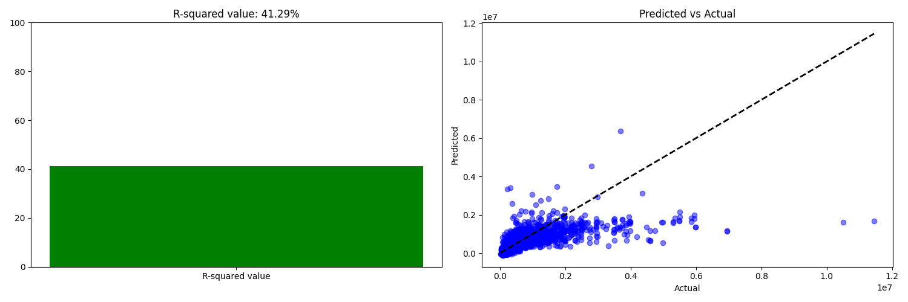
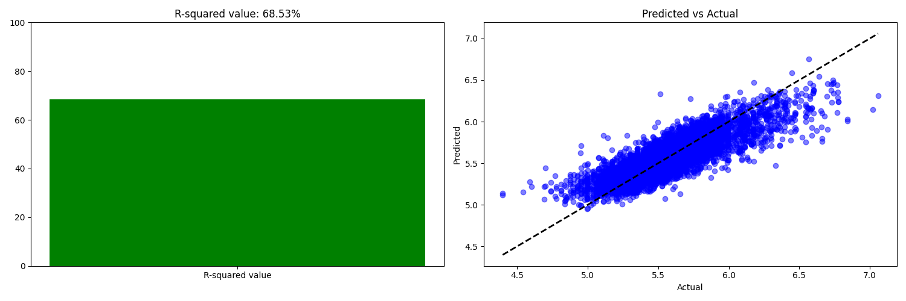
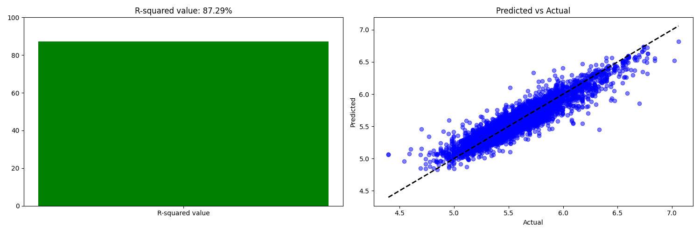

# Model card

## Remark
.pkl file is not in the repository because it is too big. You can runt the train_random_forest.py file 
to generate the model.

## Project context

Predicting the price of Houses, Apartments and Villas in Belgium.

## Data

**Input dataset:** Is scraped from leading real estate websites in Belgium.
**Target variable:** Price
**Features:** 'Bathroom Count', 'Bedroom Count', 'Habitable Surface', 'Land Surface', 'Consumption', 'Postal Code',
'Facades', 'Subtype', 'Toilet Count', 'Kitchen Type', 'State of Building',  # 'Sea view', 'Swimming Pool',
'Price', 'Longitude', 'Latitude', 'EPC', 'cd_munty_refnis', 'PopDensity', 'MedianPropertyValue', 'NetIncomePerResident'


## Model details
### Basic Linear regression model
Basic linear regression model
### Advanced Linear regression model
Advanced linear regression model with log scaling for making non linear features linear.
### Random Forest model:
Random Forest model with max_depth of 20


## Performance
### Basic Linear regression model
r_squared score on training data itself: 97.71%
r_squared score on testing data: 87.29%



### Advanced Linear regression model
r_squared score on training data itself: 67.83%
r_squared score on testing data: 68.53%


### Random Forest model
r_squared score on training data itself: 97.71%
r_squared score on testing data: 87.29%



## Limitations
### Random Forest model
It has a really great score on the training data itself and should be further tested with cross validation
to see if it is overwriting or not.

## Usage
### Install requirements
Go to [statbel.fgov.be](https://statbel.fgov.be/nl/open-data/statistische-sectoren-2023) to download the latest 
geojson (ZIP), extract the file and copy the `sh_statbel_statistical_sectors_31370_20230101.geojson` file and copy it 
to `./data/external_data/REFNIS_2023.geojson`

```bash
pip install -r requirements.txt
```

### train a model
It best to move to root src folder before running the train model file.
```bash
# train a model
python ./models/train_basic_linearregression.py
# or
python ./models/train_linearregression_log10.py
# or
python ./models/train_random_forest.py
```

## Maintainers
[](https://www.linkedin.com/in/gerrit-geeraerts-143488141)