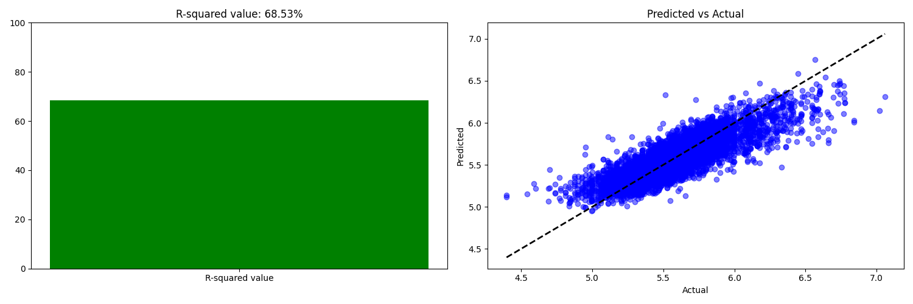

# Immo Prediction together with 🦀 Charlie 🦀


## 🏢 Description
My first Machine Learning project. Exciting! I use a dataset of houses that we scraped from the internet and in this repo 
I will apply Linear Regression together with Charlie 🦀 to predict the price of a house based on its features.

## 📦 Repo structure
```
├── assets  # some images
├── data
│   ├── external_data
│   │   ├── HouseholdIncome.xlsx
│   │   ├── PopDensity.xlsx
│   │   ├── PropertyValue.xlsx  
│   │   ├── REFNIS_CODES.geojson  # download this file!! Look below for more info
│   │   └── REFNIS_Mapping.xlsx  
│   ├── intermediate
│   │   └── joined_data.csv  # joining external data with the scraped data
│   └── raw
│       └── data.csv
├── MODELCARD.md
├── models  # the trained models
│   ├── basic_linearregression.pkl
│   ├── linearregression_log10.pkl
│   └── random_forest.pkl
├── README.md
├── requirements.txt
└── src
    ├── config.py
    ├── features  # building and transforming features
    │   ├── build_features.py
    ├   ├── pipeline.py
    │   └── transformers.py
    ├── models  # training the models and some model utils
    │   ├── model_utils.py
    │   ├── train_basic_linearregression.py
    │   ├── train_linearregression_log10.py
    │   └── train_random_forest.py
    └── utils.py  # generic utils
```

## 🚀 To retrain a model
### install requirements
Before charlie can predict the price of a house, we need to install the requirements.
```bash
pip install -r requirements.txt
```
### OPTIONAL: Update external data
If you want to update the external data, you can download the latest data from the following links:
Go to [statbel.fgov.be](https://statbel.fgov.be/nl/open-data/statistische-sectoren-2023) to download the latest 
geojson (ZIP), extract the file and copy the `sh_statbel_statistical_sectors_31370_20230101.geojson` file and copy it 
to `./data/external_data/REFNIS_2023.geojson`
and run the following command in the terminal:
```bash
cd src # move to the src folder
python join_external_data.py
```
### Train a model
Now Charlie is all set and ready to be trained. To train a model, run the following command in the terminal:
```bash
cd src # move to the src folder

# train a model
python ./models/train_basic_linearregression.py
# or
python ./models/train_linearregression_log10.py
# or
python ./models/train_random_forest.py
```
Charlie will print an R-squared score and save the model in the models folder with a similar name as the train_model.py 
file.
## Screenshot
### Basic Linear regression model

### Advanced Linear regression model

### Random Forest model

[More data about all the above models](./MODELCARD.md)

## ⏱️ Timeline
This project was done in 4 days including studying the theory and implementing the code.

## 📌 Personal Situation
This project was done as part of my AI trainee program at BeCode.

## 📚 Credits
Thank you at Bear Revels for providing the external datasets, which boosted my scores!

### Connect with me!
[](https://www.linkedin.com/in/gerrit-geeraerts-143488141)
[](https://stackoverflow.com/users/10213635/gerrit-geeraerts)
[](https://askubuntu.com/users/1097288/gerrit-geeraerts)

